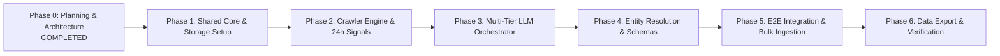

# Phase 1 Implementation Plan & Roadmap

## Executive Overview
Following the successful completion of **Phase 0 (System Architecture, Schemas, & Engineering Rules)**, this document details the recommended sequential implementation roadmap for **Phase 1 through Phase VI** of the GraphOne / FrontierAtlas Ingestion Pipeline.

---

## Phased Implementation Sequence

---

## Phase 1: Shared Infrastructure & Storage Layer
**Goal:** Establish project structure, configuration management, schema validators, logging, and database models.

### Tasks:
1. **Repository & Environment Setup:**
   - Create Python `venv` or Poetry environment with dependencies (`aiohttp`, `httpx`, `playwright`, `pydantic`, `jsonschema`, `google-generativeai`, `groq`, `psycopg2-binary`, `gspread`).
   - Create `.env.example` with placeholders for API keys (`GEMINI_API_KEY`, `GROQ_API_KEY`, `DEEPSEEK_API_KEY`, `GITHUB_TOKEN`, `GOOGLE_SHEETS_CREDENTIALS`).
2. **Configuration & Logging (`src/config/`, `src/utils/logger.py`):**
   - Implement `Settings` class using `pydantic-settings` to load environment variables safely.
   - Implement structured JSON logging utility with contextual tags (`trace_id`, `worker_id`).
3. **Database Schema & ORM/Storage Layer (`src/storage/`):**
   - Implement database connection manager (`DatabaseManager`) for SQLite/PostgreSQL.
   - Create relational tables for `startups`, `products`, `research_papers`, `jobs`, `news`, `entity_mappings`, and `dlq_records`.
4. **Schema Validator Component (`src/validators/schema_validator.py`):**
   - Implement JSON Schema validation module loading schemas from `schemas/*.schema.json`.

---

## Phase 2: Asynchronous Crawler Engine & Freshness Filter
**Goal:** Build resilient crawling adapters for static feeds, SPAs, and GitHub star tracking with 24-hour freshness logic.

### Tasks:
1. **Base Crawler Abstraction (`src/crawlers/base.py`):**
   - Implement abstract `BaseCrawler` with bounded retries, exponential backoff, jitter, and user-agent rotation.
2. **Static & SPA Crawler Implementations (`src/crawlers/http_crawler.py`, `src/crawlers/playwright_crawler.py`):**
   - Async HTTP crawler utilizing `aiohttp` for lightweight HTML & RSS feeds.
   - Playwright Async headless browser crawler for dynamic JavaScript SPAs.
3. **24-Hour Freshness Validator (`src/pipeline/freshness.py`):**
   - Implement multi-stage date extractor (microdata, og-tags, relative dates, URL regex, `Last-Modified` header).
   - Filter items strictly $\le 24$ hours old for News and Jobs.
4. **URL & Content Deduplicator (`src/pipeline/deduplicator.py`):**
   - Implement URL canonicalization and SHA256 fingerprinting.
   - Implement Redis/SQLite atomic lock claim mechanism.

---

## Phase 3: Multi-Tier LLM Orchestrator Engine
**Goal:** Build the provider abstraction chain (Gemini Flash $\rightarrow$ Groq Llama $\rightarrow$ DeepSeek) with 413 payload chunking and 429 backoff.

### Tasks:
1. **Provider Adapter Layer (`src/llm/providers/`):**
   - Implement `GeminiProvider`, `GroqProvider`, and `DeepSeekProvider` inheriting from `BaseLLMProvider`.
2. **Payload Chunker (`src/llm/chunker.py`):**
   - Implement `IntelligentPayloadChunker` to strip HTML boilerplate, score document density, and truncate payloads exceeding context windows.
3. **LLM Orchestrator (`src/llm/orchestrator.py`):**
   - Implement 3-tier fallback execution chain.
   - Add circuit breaker tracking provider health and handling 429 rate limit errors.
   - Enforce zero-hallucination prompt templates and strict schema validation callbacks.

---

## Phase 4: Deterministic Entity Resolution Engine
**Goal:** Canonicalize startup and product names against seed databases and generate auditable mapping logs.

### Tasks:
1. **Normalization Pipeline (`src/resolver/normalizer.py`):**
   - Implement Unicode NFKC, lowercase, punctuation removal, legal suffix stripping, and whitespace collapse.
2. **Seed Dictionary & Alias Matcher (`src/resolver/seed_dictionary.py`):**
   - Populate seed dictionary with canonical AI entities (e.g. OpenAI, Anthropic, Mistral AI, Cohere, Hugging Face).
   - Implement exact match and seed alias map lookup.
3. **Fuzzy Match Resolver (`src/resolver/fuzzy_matcher.py`):**
   - Implement Jaro-Winkler fuzzy matching algorithm with $d_w \ge 0.92$ threshold.
4. **Audit Mapping Logger (`src/resolver/audit_logger.py`):**
   - Produce structured `ENTITY_MAPPING` JSON records and log raw vs. canonical transformations.

---

## Phase 5: Pipeline Integration & Bulk Ingestion Execution
**Goal:** Connect crawlers, queues, workers, LLM orchestrator, entity resolver, and storage into a unified async pipeline.

### Tasks:
1. **Queue & Worker Engine (`src/pipeline/worker.py`):**
   - Implement worker task processing loops consuming from raw ingestion queues.
2. **Bulk Scrape Execution:**
   - Execute bulk ingestion targeting:
     - 1,000+ unique Startup records
     - 1,000+ unique Product records
     - 1,000+ unique Research Paper records (with live GitHub star counts fetched via API)
     - 24-hr fresh AI News items across 5 sources
     - 24-hr fresh AI Job postings across 5 job boards
3. **Fault & DLQ Verification:**
   - Verify 429, 413, rate limit, and validation failure scenarios route safely to DLQ without crashing execution.

---

## Phase 6: Data Export & Google Sheets Delivery
**Goal:** Format canonical entity tables and mapping logs for final submission.

### Tasks:
1. **Google Sheets / CSV Exporter (`src/export/gsheets_exporter.py`):**
   - Implement Google Sheets export using `gspread` emitting 6 canonical tabs:
     1. `Startups` (Min. 1,000 rows)
     2. `Products` (Min. 1,000 rows)
     3. `Research Papers` (Min. 1,000 rows, including GitHub stars)
     4. `Jobs` (All 24-hr fresh jobs found)
     5. `News` (All 24-hr fresh news found)
     6. `Entity Mapping Log` (Raw vs Canonical names)
2. **Verification & Audit:**
   - Run automated validation script to verify 0% hallucinated records, 100% provenance traceability, and strict schema compliance.
