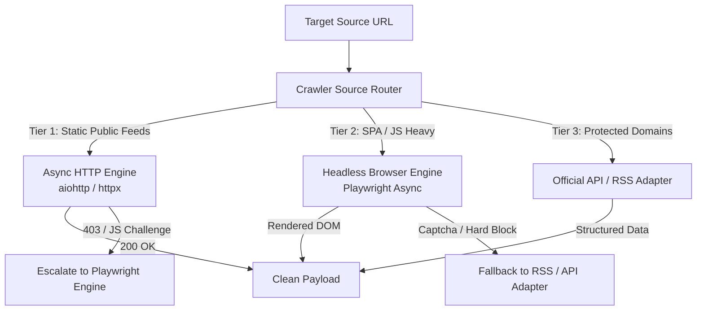

# Anti-Bot Strategy & Adaptive Scraping Framework

## Policy & Compliance Overview
The pipeline adheres strictly to legal data ingestion standards, respecting `robots.txt` rate limits, utilizing public feeds/APIs wherever available, implementing passive browser emulation, and employing compliant extraction techniques.

---

## 1. Modular Crawler Abstraction Layer

The pipeline uses an abstract `BaseCrawler` class allowing dynamic selection of the optimal fetch engine based on site protection tier:

---

## 2. Protection Tier Handling Matrix

| Site Protection Tier | Protection Target | Detection Symptoms | Adaptive Strategy | Engine Used |
| :--- | :--- | :--- | :--- | :--- |
| **Tier 1 (Light)** | Static HTML / Basic News | Standard 200 responses | Async HTTP GET with User-Agent pool | `aiohttp` / `httpx` |
| **Tier 2 (Medium)** | JS-Rendered SPAs (React/Next) | Blank `div#root`, dynamic JS scripts | Full DOM rendering after `networkidle` state | `Playwright Async` |
| **Tier 3 (Heavy)** | Cloudflare Turnstile / Datadome | HTTP 403, 539, JS Challenge page | Firefox browser context with stealth plugin, HTTP/2 TLS fingerprinting, proxy rotation | `Playwright Async` + Stealth |
| **Tier 4 (API/RSS)** | Strict Scraping Walls | Aggressive IP ban | Fallback to RSS / Atom XML feeds, Public JSON APIs (Arxiv API, GitHub API) | Python `feedparser` / API Clients |

---

## 3. Passive Anti-Bot Techniques

### 3.1 HTTP Header & TLS Fingerprint Emulation
Standard Python HTTP requests fail due to missing HTTP/2 TLS ciphers and missing browser headers. The HTTP engine enforces:
- **Modern User-Agent Rotation:** Chrome 128+, Firefox 129+, Safari 17.5 user agents.
- **Header Order Preservations:** Exact header order (`Host`, `User-Agent`, `Accept`, `Accept-Language`, `Accept-Encoding`, `Sec-Fetch-Dest`, `Sec-Fetch-Mode`, `Sec-Fetch-Site`).
- **HTTP/2 Support:** Enabled via `httpx` with `http2=True` to emulate native browser TCP/TLS handshakes.

### 3.2 Playwright Stealth Browser Contexts
When scraping Tier 2/3 sources:
- **WebGL & Canvas Spoofing:** Override `navigator.webdriver` flag to `false`.
- **Viewport Randomization:** Standard desktop resolutions (1920x1080, 1440x900, 1536x864).
- **Human Motion Emulation:** Add subtle delay variations (100ms - 500ms) between page interactions.

### 3.3 Proxy Rotation & Pool Management
- **Residential Proxy Integration:** Support for IP proxy rotation per request/session via `HTTPS_PROXY` environment configuration.
- **IP Ban Circuit Breaker:** If an IP receives 2 consecutive 403/429 responses, the proxy manager flags the proxy node for 15-minute cooldown.
