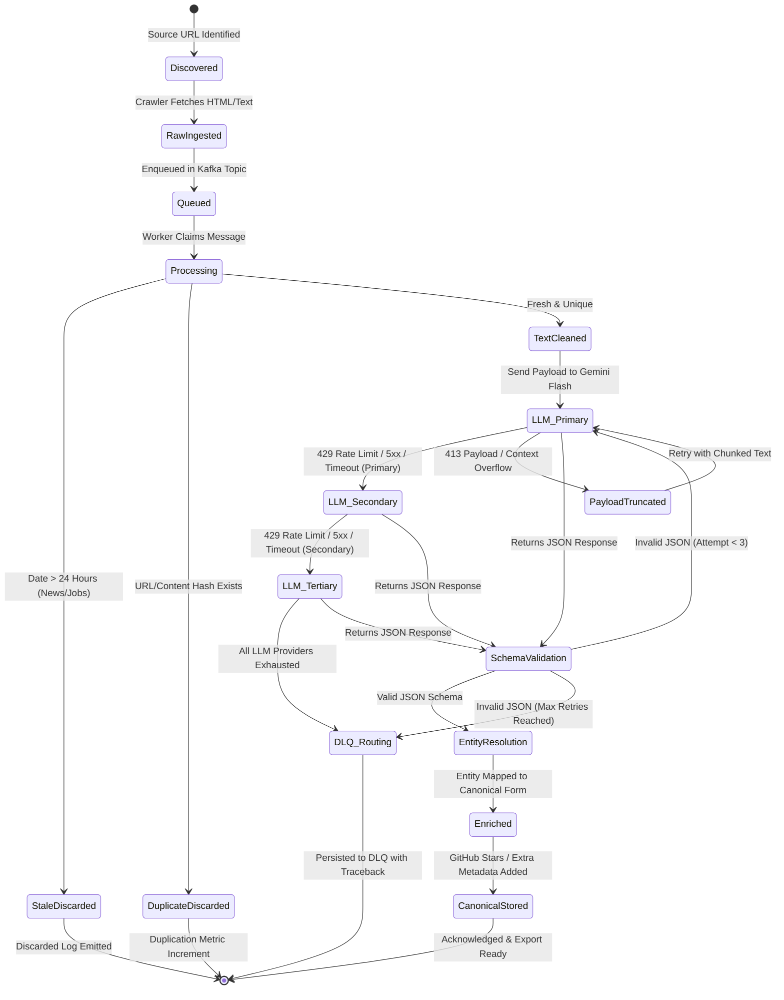

# Data Flow & Lifecycle: GraphOne / FrontierAtlas Ingestion Pipeline

## Overview
This document traces the exact data transformations, branch conditions, and state transitions of a record from raw web source ingestion to final canonical database storage or Dead-Letter Queue (DLQ) routing.

---

## E2E State Machine Diagram



---

## Lifecycle Execution Pathways

### Path 1: Normal Path (Happy Path)
1. **Discovery:** Crawler fetches HTML page from target URL `https://arxiv.org/abs/2408.01234`.
2. **Raw Staging:** Raw HTML stored in raw cache; metadata JSON `{"url": "...", "html": "...", "timestamp": "2026-09-10T14:00:00Z"}` enqueued to `queue:raw_papers`.
3. **Worker Pickup:** Worker `W-01` claims message via `XREADGROUP`.
4. **Freshness & Deduplication:** URL hash `sha256(url)` checked in Redis cache. Result: `MISS` (Unique).
5. **Text Extraction:** HTML converted to structured Markdown/Text payload.
6. **LLM Extraction:** Sent to primary provider Gemini Flash. Returns valid JSON matching `research-paper.schema.json`.
7. **Schema Validation:** `jsonschema.validate()` passes cleanly.
8. **Entity Resolution & Enrichment:** Github repository parsed (`https://github.com/org/repo`). API worker fetches live GitHub stars (`1,420 stars`).
9. **Persistence:** Written to PostgreSQL `research_papers` table. Unique constraint satisfied.
10. **ACK:** Message acknowledged on queue.

---

### Path 2: Retry Path (Transient Network / API Error)
1. Crawler attempts to fetch source URL; receives `503 Service Unavailable` or `ETIMEDOUT`.
2. Crawler increments attempt counter (`attempt = 1`).
3. Computes backoff delay $t = \text{min}(60, 2^1 \times 1.0) \times \text{jitter} = 2.4\text{s}$.
4. Retries request. If successful on attempt 2, proceeds to normal path.
5. If attempts exceed `MAX_RETRIES` (5), item routed to DLQ with error category `CRAWLER_FETCH_EXHAUSTED`.

---

### Path 3: 413 Payload / Context Window Exceeded Path
1. Raw HTML payload exceeds 100KB or LLM returns HTTP `413 Payload Too Large` / Context Window Exceeded error.
2. System intercepts 413 error and invokes `IntelligentPayloadChunker`:
   - Strips non-essential HTML boilerplate, inline styles, navigation links, and scripts.
   - Extracts top semantic text segments using document density heuristic (first 2,000 words + key tables).
3. Payload re-submitted to primary LLM.
4. If successful, proceeds to schema validation. If payload is still too large, truncates to summary window and retries.

---

### Path 4: 429 Rate Limit Path
1. Primary LLM Gemini Flash returns HTTP `429 Too Many Requests`.
2. `LLMOrchestrator` catches 429 status code:
   - Registers temporary circuit-breaker slowdown for Gemini Flash (cooldown 10s).
   - Instantly routes current request to Secondary Provider (Groq compound).
3. Groq processes payload and returns JSON response without blocking the pipeline worker.

---

### Path 5: Invalid JSON Path
1. LLM response contains non-JSON text or fails JSON Schema validation (e.g. missing required field `published_date`).
2. Validator records validation error: `ValidationError: 'published_date' is a required property`.
3. If LLM retry attempt $< 2$, payload is re-submitted with an appended prompt system instruction specifying the validation failure.
4. If validation fails repeatedly (Max 2 retries), item is saved to `dlq:schema_validation_failures` along with raw LLM response.

---

### Path 6: Duplicate Path
1. Worker computes canonical URL SHA256 string: `hash = sha256("https://example.com/news/ai-breakthrough")`.
2. Worker performs atomic Redis check: `SETNX dedup:hash 1 EX 86400`.
3. Redis returns `0` (Key already exists).
4. Worker immediately drops payload, increments `metric_duplicates_filtered`, and ACKs message.

---

### Path 7: Stale Record Path (News & Jobs <= 24 Hours)
1. Worker extracts publication date metadata (e.g. `"2026-09-07T10:00:00Z"`).
2. Worker compares with current execution timestamp `T_now`: `age_hours = (T_now - T_pub) / 3600`.
3. `age_hours` calculates to `76.0 hours` ($> 24.0$ hours).
4. Pipeline drops payload, logs stale item filtering event, and ACKs queue message.

---

### Path 8: Permanent Failure & DLQ Path
1. A payload encounters unrecoverable errors (e.g., all 3 LLM providers fail, or HTML parsing fatal crash).
2. Payload enriched with diagnostic envelope:
   ```json
   {
     "original_message": { ... },
     "failure_reason": "ALL_LLM_PROVIDERS_EXHAUSTED",
     "attempts": 5,
     "stack_trace": "...",
     "failed_at": "2026-09-10T14:05:00Z"
   }
   ```
3. Written to persistent table/file `dlq_dead_letter_records`.
4. Queue message ACKed to prevent queue blocking.
