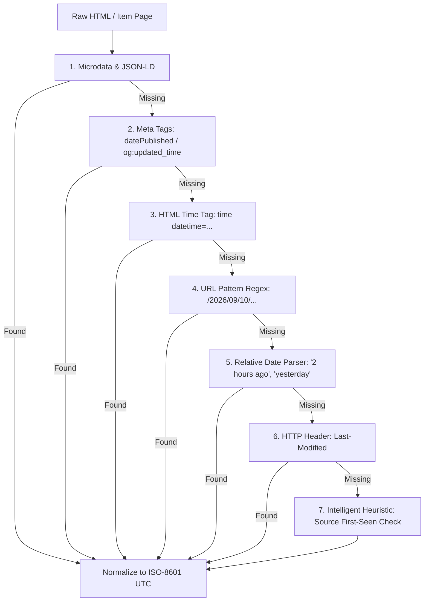

# Freshness Validation & Deduplication Architecture

## Core Objectives
1. **24-Hour Signal Guarantee:** Guarantee that 100% of ingested AI news articles and AI job postings were published within the previous 24 hours of pipeline execution.
2. **Distributed Deduplication:** Guarantee zero duplicate processing across distributed crawler nodes using deterministic URL fingerprinting, content SimHash signatures, and atomic distributed locking.

---

## 1. 24-Hour Freshness Pipeline

### 1.1 Freshness Calculation Algorithm
For every incoming news article or job posting payload, publication date $T_{\text{pub}}$ is extracted and compared against system wall clock time $T_{\text{now}}$:

$$\Delta t = T_{\text{now}} - T_{\text{pub}}$$

- **Fresh Record:** $\Delta t \le 24.0 \text{ hours}$ $\rightarrow$ Proceed to LLM Extraction.
- **Stale Record:** $\Delta t > 24.0 \text{ hours}$ $\rightarrow$ Discard payload, increment metric `items_filtered_stale`.

---

### 1.2 Multi-Stage Date Parsing Architecture
Date extraction follows a strict prioritized resolution hierarchy:



#### Relative Date Normalization
- `"2 hours ago"` $\rightarrow$ $T_{\text{now}} - 2 \text{ hours}$
- `"yesterday at 4 PM"` $\rightarrow$ $(T_{\text{now}} - 24 \text{ hours})\text{ set hour=16}$
- `"35 mins ago"` $\rightarrow$ $T_{\text{now}} - 35 \text{ minutes}$

#### Missing Date Heuristics
If a web page lacks explicit date markup:
- Compare URL path against previously ingested URL database. If the URL has never been seen before on a source monitored every 2 hours, flag as `CANDIDATE_FRESH`.
- Inspect page text for relative date indicators in body paragraphs.
- Inspect HTTP `Last-Modified` headers returned by web server.

---

## 2. Distributed Deduplication Architecture

### 2.1 Canonical URL Normalization & Fingerprinting
Raw URLs vary due to query parameters, tracking tags, and protocol variants. Prior to hash generation, URLs undergo strict canonicalization:

1. **Protocol Normalization:** Convert `http://` to `https://`.
2. **Host Normalization:** Lowercase hostname, strip `www.` prefix.
3. **Tracking Parameter Stripping:** Remove `utm_source`, `utm_medium`, `utm_campaign`, `gclid`, `fbclid`, `ref`, `s`.
4. **Path Cleaning:** Strip trailing slashes, remove default filenames (`index.html`).
5. **Query Parameter Sorting:** Alphabetize remaining query key-value pairs.

$$\text{URL Fingerprint} = \text{SHA256}\left(\text{NormalizeURL}(\text{raw\_url})\right)$$

**Example:**
- `HTTP://WWW.Example.com/jobs/ai-eng/?utm_source=twitter&id=42`
- **Normalized:** `https://example.com/jobs/ai-eng?id=42`
- **SHA256 Hash:** `e3b0c44298fc1c149afbf4c8996fb92427ae41e4649b934ca495991b7852b855`

---

### 2.2 Content SimHash & MinHash Deduplication
To prevent processing identical syndicated news articles or re-posted job listings published under different URLs:
1. **Text Clean & Tokenize:** Extract plain text body, convert to lowercase tokens, remove stop words.
2. **SimHash 64-bit Computation:** Compute 64-bit SimHash fingerprint of body text.
3. **Hamming Distance Match:** Compare candidate SimHash against 7-day rolling window of stored SimHashes.
4. **Threshold:** If Hamming Distance $d_H(\text{Hash}_A, \text{Hash}_B) \le 3$, content is flagged as duplicate ($> 95\%$ semantic identity) and discarded.

---

### 2.3 Distributed Atomic Locking (Redis Key-Value)

To guarantee multiple distributed crawler nodes never fetch or process the same URL simultaneously:

```python
async def acquire_url_claim(redis_client, url_hash: str, ttl_seconds: int = 86400) -> bool:
    """
    Acquires atomic lock for URL hash using Redis SETNX.
    Returns True if claimed (Unique); False if already claimed (Duplicate).
    """
    lock_key = f"dedup:url:{url_hash}"
    # SET key value EX ttl NX -> Only set if Not eXists
    acquired = await redis_client.set(lock_key, "claimed", ex=ttl_seconds, nx=True)
    return bool(acquired)
```
