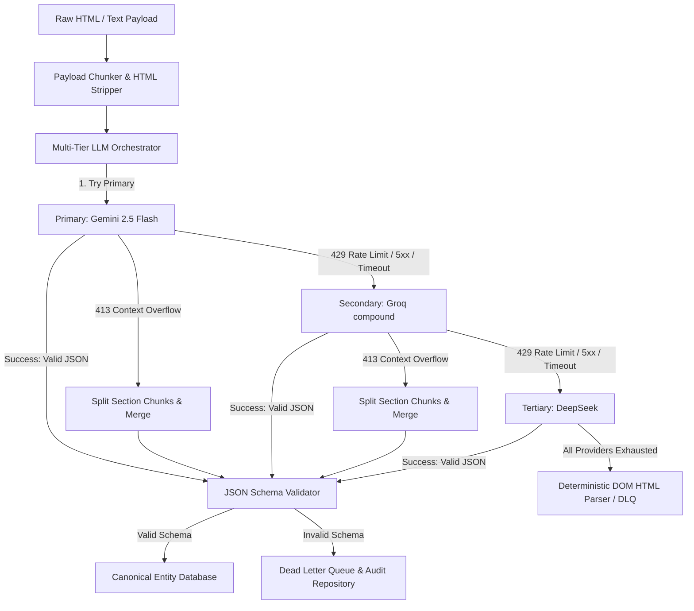

# Multi-Tier LLM Orchestration Architecture

## Implementation & Testing Verification Matrix

| Component / Feature | Implementation Status | Test Coverage |
| :--- | :--- | :--- |
| **Provider Abstraction (`BaseLLMProvider`)** | **IMPLEMENTED** (`src/llm/providers/base.py`) | **TESTED** (Mocked Unit Tests) |
| **Primary Provider (Gemini 2.5 Flash)** | **IMPLEMENTED** (`src/llm/providers/gemini.py`) | **TESTED** (Mocked Unit Tests) |
| **Secondary Fallback (Groq compound)** | **IMPLEMENTED** (`src/llm/providers/groq.py`) | **TESTED** (Mocked Unit Tests) |
| **Tertiary Fallback (DeepSeek)** | **IMPLEMENTED** (`src/llm/providers/deepseek.py`) | **TESTED** (Mocked Unit Tests) |
| **429 Rate Limit Jitter & Retry-After** | **IMPLEMENTED** (`src/llm/retry.py`) | **TESTED** (Mocked Unit Tests) |
| **413 Section Chunking & Merging** | **IMPLEMENTED** (`src/llm/chunker.py`) | **TESTED** (Mocked Unit Tests) |
| **Schema Validation & Non-Fabrication** | **IMPLEMENTED** (`src/validators/schema_validator.py`) | **TESTED** (Mocked Unit Tests) |
| **Provenance Preservation** | **IMPLEMENTED** (`src/llm/orchestrator.py`) | **TESTED** (Mocked Unit Tests) |
| **Telemetry & Observability Metrics** | **IMPLEMENTED** (`src/llm/orchestrator.py`) | **TESTED** (Mocked Unit Tests) |
| **Live LLM Execution (Live API Keys)** | **DESIGNED BUT NOT LIVE VERIFIED** (API keys unconfigured in `.env`) | **LIVE_LLM_VERIFICATION_BLOCKED** |

---

## Provider Fallback Chain Architecture



---

## Technical Specifications

### 1. Abstract Provider Interface
All LLM provider implementations inherit from `BaseLLMProvider`:

```python
class BaseLLMProvider(ABC):
    @abstractmethod
    async def extract_structured(
        self, 
        prompt_text: str, 
        target_schema: dict, 
        system_instruction: str,
        timeout_seconds: float = 30.0
    ) -> LLMResponse:
        """
        Executes structured JSON extraction.
        Returns normalized LLMResponse(raw_response, extracted_json, tokens_used, execution_time_seconds).
        Raises: RateLimitException, ContextWindowExceededException, LLMAuthException, LLMServerException
        """
        pass

    def estimate_tokens(self, text: str) -> int:
        """Estimates token count (~4 chars per token rule of thumb)."""
        return max(1, len(text) // 4)
```

---

### 2. Provider Hierarchy & Model Configuration

| Priority Tier | Provider Class | Model Setting | Environment Variable | Default Model |
| :--- | :--- | :--- | :--- | :--- |
| **Tier 1 (Primary)** | `GeminiProvider` | `LLM_PRIMARY_MODEL` | `GEMINI_API_KEY` | `gemini-2.5-flash` |
| **Tier 2 (Secondary)**| `GroqProvider` | `LLM_SECONDARY_MODEL` | `GROQ_API_KEY` | `llama-3.1-70b-versatile` |
| **Tier 3 (Tertiary)** | `DeepSeekProvider` | `LLM_TERTIARY_MODEL` | `DEEPSEEK_API_KEY` | `deepseek-chat` |

---

### 3. HTTP Error Classification & Retry Policy

| HTTP Code / Error Class | Exception Class | Retryable? | Behavior |
| :--- | :--- | :--- | :--- |
| **401 / 403** | `LLMAuthException` | **NO** | Fail immediately; log auth error; fall back to next provider. |
| **400** | `LLMBadRequestException` | **NO** | Fail immediately; log bad request error. |
| **404** | `LLMNotFoundException` | **NO** | Fail immediately; log model not found error. |
| **429** | `RateLimitException` | **YES** | Honor `Retry-After` header if present (up to max delay); otherwise full jitter exponential backoff (`min(max_delay, base * 2^attempt) * uniform(0.5, 1.0)`). |
| **413** | `ContextWindowExceededException` | **SPECIAL** | Trigger section chunking (`split_into_structural_chunks`), extract chunks, merge results (`merge_partial_extractions`). |
| **500, 502, 503, 504** | `LLMServerException` | **YES** | Bounded retry (max 3 retries); fall back to next provider on exhaustion. |
| **Timeout** | `LLMTimeoutException` | **YES** | Bounded retry; fall back to next provider on exhaustion. |
| **Invalid JSON** | `MalformedResponseException` | **YES** | Bounded repair retry; fall back to next provider on failure. |

---

### 4. 413 Structural Section Chunking & Merging (`IntelligentPayloadChunker`)

When raw HTML/text payloads exceed context limits or trigger HTTP `413 Payload Too Large`:
1. **HTML Boilerplate Cleanup:** Removes script tags, style blocks, SVG icons, and navigation menus.
2. **Structural Chunking:** Splits document along paragraph and section boundaries (`\n\n`) without cutting in the middle of sentences or entities.
3. **Chunk Extraction:** Extracts structured partial JSON for each section chunk.
4. **Partial Merging:** Combines list fields (e.g. `authors`), merges content dictionaries, and selects longest non-empty summaries without fabricating missing keys.

---

### 5. Zero-Fabrication & Provenance Directives
- **Zero Fabrication:** If a field (e.g., `employeeCount`, `github_stars`) is absent from source text, it is set to `null`. Missing fields are NEVER invented.
- **Provenance Preservation:** Every canonical entity produced retains original source attributes: `source_url`, `source_name`, `collectedAt`, and `content_hash`.

---

### 6. Observability Metrics
Telemetry instrumentation tracks aggregate execution metrics:
- `llm_requests_total`: Total extraction invocations.
- `llm_success_total`: Successful structured extractions.
- `llm_failure_total`: Failures across all provider tiers.
- `llm_fallback_total`: Provider fallback transitions.
- `llm_429_total`: HTTP 429 rate limit events.
- `llm_413_total`: HTTP 413 context window overflow events.
- `llm_schema_validation_failure_total`: Schema validation failures.
- `llm_total_tokens_in`: Input token consumption.
- `llm_total_latency_ms`: Total execution latency.
