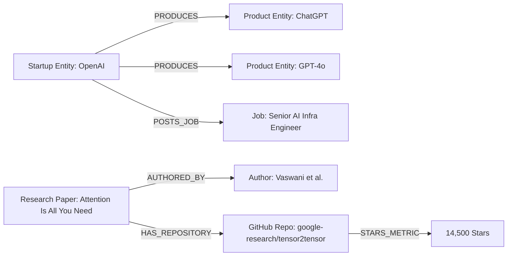

# Data & Storage Strategy Matrix

## Architecture Overview
The storage architecture separates concerns across raw staging, canonical relational storage, transient operational caching, entity mapping logs, and optional graph/vector stores to ensure high performance, auditability, and relational integrity.

---

## Storage Layer Matrix

| Storage Layer | Tech Choice (Demo) | Tech Choice (Production Scale) | Schema Type | Rationale & Justification |
| :--- | :--- | :--- | :--- | :--- |
| **Raw Payload Staging** | Local File System (`data/raw/`) | AWS S3 / MinIO / GCS | Unstructured HTML / Compressed JSON | Preserves raw provenance; permits full offline re-parsing without re-crawling. |
| **Canonical Entities** | SQLite / PostgreSQL | Managed PostgreSQL (RDS / Aurora) | Relational SQL (Strict Schemas) | Enforces strict foreign keys, unique constraints (`source_url`), ACID transactions, and standard SQL queries. |
| **Deduplication State**| In-Memory Cache / SQLite | Redis Sentinel / Cluster | Key-Value TTL Pairs | Sub-millisecond lookup latency for SHA256 URL hashes, 24-hr sliding bloom filters, and distributed locks. |
| **Entity Mapping Logs**| Local Log File / SQLite | ClickHouse / PostgreSQL Log Table | Append-Only Audit JSON | Full audit trail of raw vs. canonical strings, match methods, and confidence scores for entity resolution analytics. |
| **Graph Storage (Optional)**| In-Memory NetworkX / SQL | Neo4j / AWS Neptune | Property Graph (Nodes & Edges) | Maps multi-hop relationships (`STARTUP` $\rightarrow$ `PRODUCES` $\rightarrow$ `PRODUCT`; `RESEARCH_PAPER` $\rightarrow$ `USES_REPO` $\rightarrow$ `GITHUB_REPO`). |
| **Vector Storage (Optional)**| FAISS / SQLite Vector | Qdrant / Pgvector | 1536-dim Vector Embeddings | Enables semantic similarity search across research paper abstracts and product descriptions. |

---

## Relational vs. Document Store Evaluation

### Why Relational PostgreSQL (over MongoDB / Document Stores)?
1. **Strict Schema Constraints:** Product and Research Paper records require strict relational foreign key links back to Startup canonical entities.
2. **ACID Transactions & Upsert Primitives:** Atomic `INSERT ... ON CONFLICT (source_url) DO UPDATE` ensures distributed workers cannot write duplicate records even under high race conditions.
3. **Data Integrity:** Rigid column types (`INTEGER`, `TIMESTAMP`, `BOOLEAN`) prevent bad LLM extractions from corrupting entity tables.

---

## Vector & Graph Store Multi-Hop Relationships

While a relational database serves as the canonical source of truth, Graph and Vector stores provide distinct capabilities at production scale:

### Graph Storage (Neo4j / NetworkX)
- **Use Case:** Entity relationship discovery. Answers multi-hop queries such as *"Find all AI startups with research papers referencing GitHub repositories with over 5,000 stars."*

### Vector Storage (Pgvector / Qdrant)
- **Use Case:** Semantic search & clustering. Enables querying *"Find all products solving automated document summarization with freemium pricing models."*
